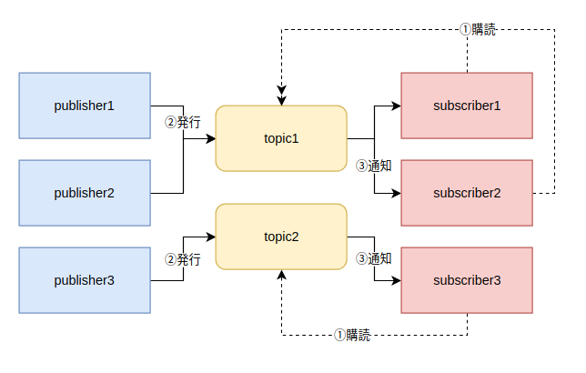
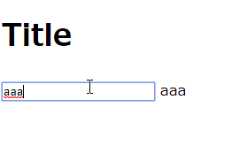

# my-pubsub

## 概要

最近なにかと話題のリアクティブプログラミングですが、イマイチよく理解していないので勉強してみました。
リアクティブプログラミングを勉強し始めると必ずと言ってもいいほどよく出てくるのが、 **Pub/Sub メッセージングモデル** です。  
今回はリアクティブプログラミングを完全に理解するための第一歩として、シンプルな PubSub を自作してみようかと思います。

PubSub をググると GCP の Cloud Pub/Sub が引っかかるようになってしまった・・・

## Pub/Sub メッセージングモデル

> 出版-購読型モデル（しゅっぱん-こうどくがたモデル、英: Publish/subscribe）は、非同期メッセージングパラダイムの一種であり、メッセージの送信者（出版側）が特定の受信者（購読側）を想定せずにメッセージを送るようプログラムされたものである。出版されたメッセージはクラス分けされ、購読者に関する知識を持たない。購読側は興味のあるクラスを指定しておき、そのクラスに属するメッセージだけを受け取り、出版者についての知識を持たない。出版側と購読側の結合度が低いため、スケーラビリティがよく、動的なネットワーク構成に対応可能である。

([Wikipedia](https://ja.wikipedia.org/wiki/%E5%87%BA%E7%89%88-%E8%B3%BC%E8%AA%AD%E5%9E%8B%E3%83%A2%E3%83%87%E3%83%AB)より引用)

### 登場人物

- publisher(出版者)
- subscriber(購読者)
- topic(トピック)

最低限の機能としてはこんなイメージ



## JavaScript で実装してみた

```javascript:pubsub.js
class Pubsub {
  constructor() {
    this.topics = {};
    this.subCount = 0;
  }

  publish(topic, args) {
    if (!this.topics[topic]) {
      return;
    }
    const subscribers = this.topics[topic];
    subscribers.forEach(sub => {
      sub.callback(args);
    });
  }

  subscribe(topic, cb) {
    if (!this.topics[topic]) {
      this.topics[topic] = [];
    }
    const subid = `subscriber_${this.subCount++}`;
    this.topics[topic].push({
      subscriberId: subid,
      callback: cb,
    });
    return subid;
  }

  unsubscribe(subid) {
    const targets = [];
    Object.keys(this.topics).forEach(k => {
      this.topics[key].forEach((t, idx) => {
        if (t.subscriberId === subid) {
          targets.push({
            key: k,
            index: idx,
          });
        }
      });
    });
    targets.forEach(target => {
      this.topics[target.key].slice(target.index, 1);
    });
  }
}

export default new Pubsub();
```

適当な HTML を用意して・・・

```html:index.html
<!DOCTYPE html>
<html lang="en">
  <head>
    <meta charset="UTF-8" />
    <meta name="viewport" content="width=device-width, initial-scale=1.0" />
    <meta http-equiv="X-UA-Compatible" content="ie=edge" />
    <title>PubSubメッセージングモデル</title>
  </head>
  <body>
    <div id="app">
      <div id="header">
        <h1>Title</h1>
      </div>
      <div id="main">
        <input type="text" id="message-input" />
        <span id="reactive-message"></span>
      </div>
    </div>
    <script src="./src/index.js" type="module"></script>
  </body>
</html>
```

使う側の JavaScript

```javascript:index.js
import Pubsub from './pubsub.js';

document.getElementById('message-input').addEventListener('input', ev => {
  Pubsub.publish('input:message', ev.target.value);
});

Pubsub.subscribe('input:message', args => {
  const target = document.getElementById('reactive-message');
  target.innerHTML = args;
});
```

こんな感じで動く



## まとめ

最低限の機能を持った PubSub を実装してみました。  
疎結合に色々処理が出来ていい感じだと思います！
